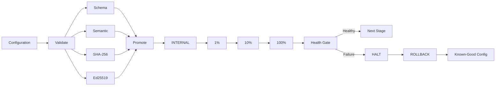

# Gaurav Ghodage

### DevOps Engineer · SRE · Kubernetes · AWS

**Building reliable infrastructure, safer deployments, and automation for distributed systems.**

  
  

---

## 🚀 Featured Project

### Blast-Radius Guard

**Safe configuration delivery for distributed Kubernetes systems.**

A production-style DevOps/SRE engineering project that validates configuration, verifies integrity and signatures, progressively promotes changes across Kubernetes cells, monitors health, and automatically halts and rolls back unsafe releases.

**Validation → Signing → Staged Rollout → Health Gate → Automatic Rollback**

  
  
  

**Engineering highlights**

| Area | Implementation |
|---|---|
| Configuration safety | Schema + semantic validation + duplicate/dangerous-rule checks |
| Integrity | SHA-256 verification + atomic configuration handling |
| Security | Ed25519 detached signatures + signature enforcement |
| Delivery | INTERNAL → 1% → 10% → 100% staged rollout |
| Reliability | Health gates + automatic HALT → ROLLBACK |
| Recovery | Previous-config tracking + durable rollout-state recovery |
| Cloud | Versioned S3 artifacts + least-privilege IAM |
| Observability | Prometheus consumer + controller metrics |
| Automation | GitHub Actions + Terraform + Python |

**→ [Open the project](https://github.com/gauravghodevs/k8s-config-consumer)**

---

## 🧭 Architecture at a Glance

> **Design principle:** reduce blast radius before increasing exposure.

---

## 📊 Engineering Dashboard

  
  

  

---

## 🛠️ Technology Stack

### Cloud & Infrastructure

  
  
  
  

### Containers & Platform

  
  
  

### CI/CD & Observability

  
  
  

### Engineering & Automation

  
  
  
  

---

## 🎯 What I Build

- Reliable CI/CD pipelines and deployment workflows
- Kubernetes operations and configuration delivery systems
- Infrastructure automation with Terraform
- Cloud infrastructure and AWS automation
- Observability and operational tooling
- Failure handling, rollback, and recovery mechanisms
- Security controls around configuration and releases

---

## 🔭 Current Engineering Focus

**Kubernetes · AWS · CI/CD · Observability · Infrastructure as Code · Production Automation**

I focus on understanding **why systems fail, how to reduce deployment risk, and how to automate recovery** rather than only automating the happy path.

> **Reliability over convenience. Automation over manual operations. Safe delivery over risky releases.**

---

## 📌 Featured Repository

### [Blast-Radius Guard](https://github.com/gauravghodevs/k8s-config-consumer)

`Python` · `Kubernetes` · `Docker` · `AWS S3` · `Terraform` · `Prometheus` · `GitHub Actions`

A local production-style simulation of progressive configuration delivery with validation, cryptographic signing, health-gated promotion, automatic rollback, observability, and state recovery.

**Verified project signals:** 28 automated tests · 3 Kubernetes cells · Ed25519 signing · S3 versioning · Prometheus metrics · Terraform · CI/CD

---

## 🤝 Let's Connect

I'm interested in opportunities involving **DevOps, SRE, Cloud Infrastructure, Kubernetes, Platform Engineering, and CI/CD**.

**Best way to reach me:** [GitHub profile](https://github.com/gauravghodevs)

If you're reviewing my work, start with **Blast-Radius Guard** — it is the project that best represents how I approach reliability, automation, and safe delivery.

---

  <i>Build systems that are safe to change.</i>

